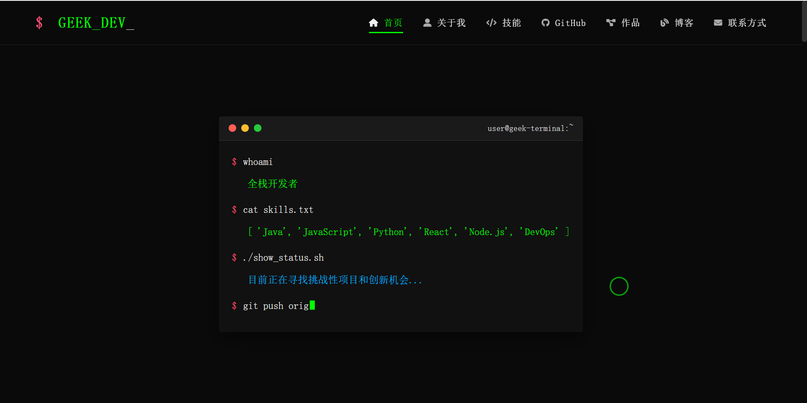

# GEEK_DEV 个人极客风格网站

一个充满极客风格的个人网站模板，具有终端界面元素和现代化设计。完美展示开发者的项目、技能和作品集。

<!-- 请将下面URL中的"123xiao/geek-dev-personal-site"替换为你自己的GitHub仓库 -->

[](https://deploy.workers.cloudflare.com/?url=https://github.com/123xiao/geek-dev-personal-site)

## 在线预览

您可以通过以下链接访问在线演示版本：
[在线演示版本](https://123408.xyz)

## 特性

- 🖥️ 终端风格界面元素
- 🎨 极客审美设计
- 📱 完全响应式布局
- 🔧 易于自定义的配置文件
- 🚀 简单部署，无需后端
- 📊 技能展示区域
- 📂 项目和作品集展示
- 📝 博客文章区域
- 📱 联系方式和社交媒体链接
- 🔍 GitHub 项目集成
- ⚡ 快速加载
- 🌐 针对搜索引擎优化
- 🔄 动态内容加载
- 🔍 自定义 404 页面

## 预览



## 技术栈

- HTML5
- CSS3
- JavaScript (ES6+)
- Font Awesome 图标
- 响应式设计

## 快速开始

### 本地安装

1. 克隆仓库

   ```bash
   # 请将下面的URL替换为你自己的GitHub仓库
   git clone https://github.com/123xiao/geek-dev-personal-site.git
   cd geek-dev-personal-site
   ```

2. 打开项目
   - 使用任意代码编辑器打开项目文件夹
   - 直接在浏览器中打开 `index.html` 文件

### 自定义配置

修改 `config.js` 文件以自定义网站内容：

```javascript
const websiteConfig = {
  // 基本信息
  basics: {
    name: "你的名字",
    title: "你的职位",
    // 其他基本信息...
  },

  // 更多配置...
};
```

## 部署

### 方法 1：一键部署到 Cloudflare Pages

<!-- 请将下面URL中的"123xiao/geek-dev-personal-site"替换为你自己的GitHub仓库 -->

[](https://deploy.workers.cloudflare.com/?url=https://github.com/123xiao/geek-dev-personal-site)

1. 点击上方"部署到 Cloudflare Pages"按钮
2. 登录你的 Cloudflare 账户（如果需要注册，请先注册）
3. Cloudflare 会自动从 GitHub 导入项目
4. 配置部署选项：
   - 项目名称：输入你喜欢的名称
   - 生产分支：main（或 master）
   - 构建命令：留空
   - 构建输出目录：留空
5. 点击"保存并部署"
6. 部署完成后，你可以在 Cloudflare Dashboard 中为网站配置自定义域名

### 方法 2：手动部署到 Cloudflare Pages

1. 在 Cloudflare 仪表板中，进入 Pages 部分
2. 点击"创建项目"按钮，选择"连接到 Git"
3. 连接你的 GitHub/GitLab 账户并授权 Cloudflare
4. 选择此项目的仓库
5. 部署设置中：
   - 构建命令：留空
   - 构建输出目录：留空或填写 `/`
6. 点击"保存并部署"

### 方法 3：部署到任何静态网站托管服务

由于这是一个纯静态网站，你可以将其部署到任何提供静态网站托管的服务，如：

- GitHub Pages
- Netlify
- Vercel
- Firebase Hosting
- Amazon S3

只需上传所有文件到对应的托管服务即可。

## 文件结构

```
/
├── index.html          # 主页
├── 404.html            # 404错误页面
├── style.css           # 样式表
├── script.js           # 主要JavaScript
├── config.js           # 配置文件
└── favicon.ico         # 网站图标
```

## 自定义

### 修改内容

所有网站内容都可以通过修改 `config.js` 文件进行自定义，包括：

- 个人信息
- 技能列表
- GitHub 项目
- 作品集项目
- 博客文章

### 修改样式

要自定义网站外观，编辑 `style.css` 文件。主要颜色和主题变量定义在 CSS 文件的顶部：

```css
:root {
  --primary-color: #00ff00;
  --secondary-color: #0c0c0c;
  --text-color: #f0f0f0;
  /* 更多变量... */
}
```

## 许可证

MIT License

## 作者

[无名键客](https://github.com/123xiao)

---

如果你喜欢这个项目，请给它一个星星 ⭐
